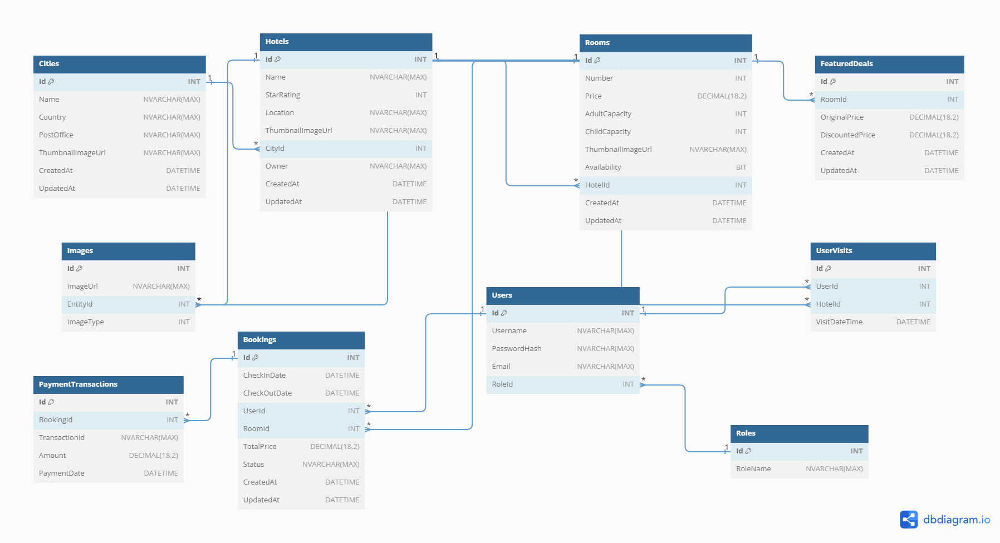
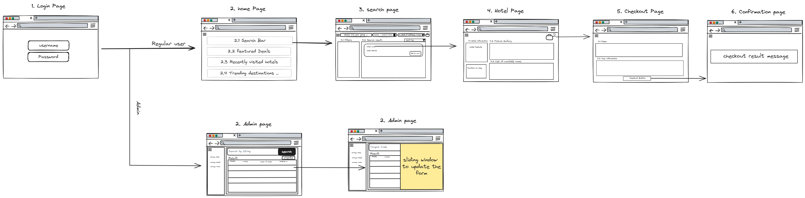

# Travel and Accommodation Booking Platform - Backend

## Prerequisites

- **.NET Core 5.0+**: Ensure that you have .NET Core 5.0 or higher installed.
- **Entity Framework Core**: Familiarize yourself with Entity Framework Core for database interactions.

## Database Schema

Before we delve into the backend development, let's take a look at the database schema. The schema serves as the foundation of the system and includes tables representing essential entities such as Users, Hotels, Bookings, and more.



## Project Setup

1. **Database Creation**:
   - Create a SQL Server database named **`TravelBookingDatabase`** using SQL Server Management Studio (SSMS).

2. **Backend Setup**:
   - Create a new ASP.NET Core Web API project named **`TravelBooking.API`** for the backend.
   - Set up Entity Framework Core in the **`TravelBooking.API`** project.

3. **Database Migrations**:
   - Write migrations to create tables for entities such as Users, Hotels, Reservations, etc. The migration files should reside in the **`Data/Migrations`** folder.

## Pages Overview

Lets Take a look on how this project is expected to look to gain a better understanding:



### 1. Login Page

- **Features**: Fields for entering a username and password.
- **Backend Implementation**: Implement secure user authentication using JWT. Validate user credentials and generate tokens.

### 2. Home Page

#### 2.1 Robust Search Functionality

- **Features**: Central search bar, interactive calendar, adjustable controls for adults and children, and room selection.
- **Backend Implementation**: Create APIs for handling hotel searches with various parameters.

#### 2.2 Featured Deals Section

- **Features**: Display of 3-5 hotels with thumbnails, names, locations, and prices.
- **Backend Implementation**: Fetch and display featured hotels with relevant details.

#### 2.3 User's Recently Visited Hotels

- **Features**: Display personalized last 3-5 visited hotels with details.
- **Backend Implementation**: Retrieve and showcase recently visited hotels for the logged-in user.

#### 2.4 Trending Destination Highlights

- **Features**: Curated list of top 5 visited cities with thumbnails.
- **Backend Implementation**: Fetch and display trending destination information.

### 3. Search Results Page

#### 3.1 Comprehensive Search Filters

- **Features**: Sidebar filters for price range, star rating, and amenities.
- **Backend Implementation**: Implement APIs to filter search results based on user preferences.

#### 3.2 Hotel Listings

- **Features**: List of hotels matching search criteria with thumbnails and relevant details.
- **Backend Implementation**: Retrieve and display hotel listings based on search parameters.

### 4. Hotel Page

#### 4.1 Visual Gallery

- **Features**: High-quality fullscreen images of the hotel.
- **Backend Implementation**: Fetch and showcase hotel images.

#### 4.2 Detailed Hotel Information

- **Features**: Hotel name, star rating, description, guest reviews, and interactive map.
- **Backend Implementation**: Provide APIs for detailed hotel information.

#### 4.3 Room Availability and Selection

- **Features**: List of room types with images, descriptions, and prices.
- **Backend Implementation**: Enable users to add selected rooms to the cart for booking.

### 5. Secure Checkout and Confirmation

#### 5.1 User Information and Payment

- **Features**: Form for personal details, payment method, and optional special requests.
- **Backend Implementation**: Handle user information, payment processing, and optional remarks.
- **Third Party API**: Used Braintree Paypal payments to handle the payment process.

#### 5.2 Confirmation Page

- **Features**: Display booking details, confirmation number, hotel address, and options to print or save as PDF.
- **Backend Implementation**: Generate and show confirmation details, send confirmation email.

### 6. Admin Page for Easy Management

#### 6.1 Functional Left Navigation

- **Features**: Collapsible navigator for managing Cities, Hotels, and Rooms.
- **Backend Implementation**: Provide APIs for admin navigation and management.

#### 6.2 Admin Search Bar

- **Features**: Filters for efficient search in admin panels.
- **Backend Implementation**: Implement APIs for filtering data in admin grids.

#### 6.3 Detailed Grids

- **Features**: Grids with detailed information for Cities, Hotels, and Rooms.
- **Backend Implementation**: Fetch and display grid data with creation and modification dates.

#### 6.4 Create Button

- **Features**: Opens a form for creating Cities, Hotels, or Rooms.
- **Backend Implementation**: Provide APIs for creating entities.

#### 6.5 Entity Update Form

- **Features**: Accessible by clicking on a grid row, allows updating City, Hotel, and Room details.
- **Backend Implementation**: Implement APIs for updating entity details.


## Features

The backend of the Travel and Accommodation Booking Platform is designed to provide a robust and scalable solution for managing hotel bookings and related functionalities.

Here are the key features:

### 1. User Authentication

- **Secure User Authentication**: Implement secure JWT authentication for user sessions.
- **User Permissions Management**: Design a robust permission system based on roles for controlling access to different parts of the application.

### 2. Hotel Management

- **City, Hotel, and Room Management**: Create, update, and delete cities, hotels, and rooms with detailed information.
- **Comprehensive Search Filters**: Implement sidebar filters for search criteria such as price range, star rating, and amenities.

### 3. Booking Functionality

- **Efficient Booking Process**: Enable users to book rooms with a secure checkout process.
- **Confirmation Page**: Display detailed booking information, including confirmation number, hotel details, room details, dates, and total price.

### 4. Admin Management

- **Functional Left Navigation**: Provide administrators with a collapsible navigator for managing cities, hotels, and rooms.
- **Admin Search Bar**: Implement filters for easy navigation in admin panels.
- **Detailed Grids**: Display grids with relevant information for cities, hotels, and rooms, including creation and modification dates.

### 5. Technical Excellence

- **Clean Code Principles**: Adhere to clean code practices for maintainability and readability.
- **Efficient Data Handling**: Optimize data storage, retrieval, and manipulation for performance.
- **Robust Error Handling and Logging**: Implement comprehensive error handling and logging for effective debugging.

### 6. Testing and Documentation

- **Unit Testing**: Develop and maintain a suite of unit tests to ensure functionality and reliability.
- **API Documentation**: Create and maintain detailed API documentation, including setup guides and examples.


The backend is designed to provide a seamless and secure experience for both users and administrators, with a focus on efficient data management and technical excellence.

## Getting Started

Now that you have set up the project, follow these steps to get started:

1. Clone the repository:
   ```bash
   git clone [https://github.com/Ibrahim-Nobani/Travel-and-Accommodation-Booking-Platform.git]
   ```

2. Navigate to the **`TravelBooking.API`** project:
   ```bash
   cd TravelBooking.API
   ```

3. Restore project dependencies:
   ```bash
   dotnet restore
   ```

4. Apply Entity Framework Core migrations to create the database:
   ```bash
   dotnet ef database update
   ```

## How to Run

To run the backend API, use the following steps:

1. Navigate to the **`TravelBookingPlatform`** project:
   ```bash
   cd TravelBookingPlatform
   ```

2. Run the project:
   ```bash
   dotnet run
   ```

3. Access the API endpoints through your preferred API client or tool.

Ensure that the necessary environment configurations are set, such as database connection strings and any additional settings specified in the **`appsettings.json`** file.

## Contributors

- [Ibrahim Nobani]

## License

This project is licensed under the MIT License - see the [LICENSE](LICENSE) file for details.
```